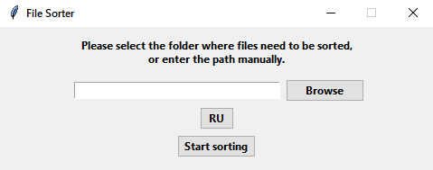

# File Sorter

A simple file sorting utility with a graphical interface.

---

## Platform

- Windows 10/11

- ---

## Features

- Sort files by extension
- One-click sorting

---

## Built with

- Python
- Tkinter

---

## How to use

- Select the folder in which you want to sort by clicking the "Browse" button
- Click "Start sorting"

---

## Preview

---

## Download

**Download the latest version from the [Releases](https://github.com/foxinchess-source/file-sorter/releases) page.**
